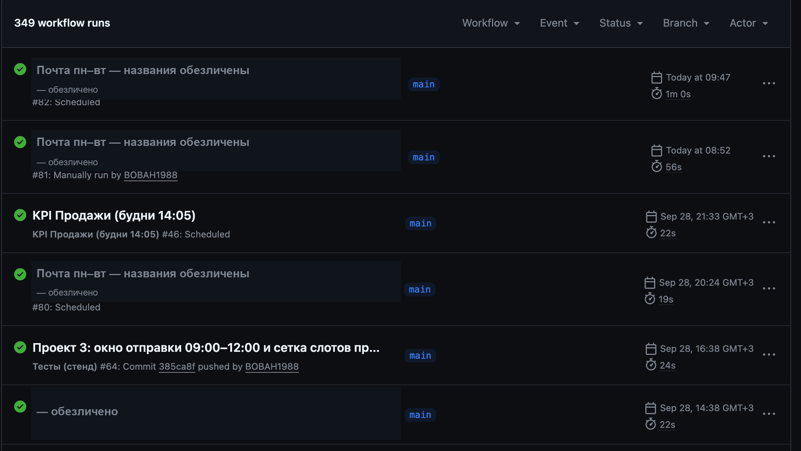

# mail-automation — автоматизация почтовых процессов

**Стек:** Python, GitHub Actions, IMAP/SMTP, openpyxl, xls2xlsx, CI/CD  
**Репозиторий:** приватный — исходный код и архитектура доступны по запросу

## Что это

Автоматизированная обработка почты по настроенным сценариям: рассылка
прайсов, пересылка заказов и счетов, ответы по дебиторке, KPI-отчёты.
Работает в облаке, без включённого компьютера и без ручного запуска
каждого сценария.

Система закрыла рутинный цикл B2B-опта: входящее письмо → разбор вложения
→ обработка Excel → ответное письмо контрагенту. Раньше эти операции
выполнялись вручную, с задержками и ошибками.

Направление документов зафиксировано: прайсы **приходят от поставщиков
и рассылаются клиентам**, счета **пересылаются от поставщика клиенту**,
заказы и платёжки — оператору, отчёты формируются для руководства.

## Ключевые цифры

| Показатель | Значение |
|---|---|
| Проектов | 14 |
| Проверок (стенд сценариев + pytest) | 131 сценарий + 50 pytest-тестов |
| Участия человека в штатном режиме | 0 |
| Режим работы | 24/7, по расписанию |

## Архитектура

**Диспетчер → оркестраторы → общие модули → почта / Excel**

- **Диспетчер** `run_all.py` — единая точка расписания (`JOBS`),
  параллельный запуск до 4 проектов через `ThreadPoolExecutor`.
- **Оркестраторы** — по одному на проект; 13 из 14 — наследники общего
  базового класса `ProjectBase` (окна `retry_before`/`deadline`, уведомления
  о пропуске и ошибках, тестовый режим — в одном месте). Исключение —
  проект 13 «Рекомендации к заказу»: отдельный workflow по понедельникам
  (сборка отчёта на 26 745 позиций из прайса остатка в письме и продаж
  из репозитория), поэтому он помечен standalone и не входит в общий
  диспетчер опроса почты.
- **Общие модули:**
  - `mail_common.py` — работа с почтой (IMAP/SMTP, ретраи только транзиторных сбоев);
  - `project_base.py` — базовый класс проектов (окна, уведомления, тестовый режим);
  - `kpi_processors.py` — чистая логика KPI (разбор xlsx, ступени/начисления, письмо);
  - `price_processor.py` — обработка прайсов и файлов задолженности;
  - `send_email.py` — формирование и отправка писем, вложения;
  - `notify.py` — служебные и аварийные уведомления;
  - `constants.py` — расписание, настройки, тексты шаблонов.
- **Слой почты / Excel** — чтение входящих писем, конвертация и разбор
  xls/xlsx (openpyxl, xls2xlsx), отправка через SMTP.

### Надёжность и безопасность

- **Retry** — только для транзиторных сетевых сбоев; ошибки
  аутентификации не повторяются (защита от блокировки ящика).
- **Защита от дублей** — проверка папки «Отправленные» перед рассылкой.
- **Приватность рассылки** — BCC: получатели не видят друг друга.
- **Секреты** — учётные данные и ключи хранятся только в GitHub Secrets,
  в коде их нет.
- **Аварийный канал** — при сбое обработки приходит письмо «❌ Ошибка».
- **Логирование** — структурированное, с временем МСК.
- **Тестовый режим** — ручной запуск можно прогнать на себя,
  не затрагивая клиентов.
- **Технические нюансы IMAP:** месяц в `SEARCH` всегда передаётся
  английским словом — локаль не влияет на результат.
- **Задержки GitHub Actions** учтены: утренние слоты сдвинуты на 3 часа
  раньше, чтобы попасть в рабочее окно.

### Рефакторинг и оптимизация процесса

Отдельно стоит задача, которую ИИ помогал разобрать, — приведение проекта к 
структуре, в которой и человек, и ИИ работают с меньшим расходом контекста.

**Аудит.** По моему запросу ИИ провёл разбор структуры и вернул план 
рефакторинга с цифрами. Фактически картина была такой: 12 копий функции 
уведомлений, 9 копий подключения к почте, 5 копий проверки писем — в 11 
сценариях. Любую правку приходилось искать сразу во многих местах, а для ИИ 
это ещё и лишний расход контекста на каждое изменение.

**Что сделано.** Общая логика вынесена в переиспользуемые модули: общий цикл
чтения почты (`mail_common.find_messages()`), единый SMTP-код с ретраями,
расписание в одной таблице `JOBS` (`run_all.py`), зависимости закреплены
версиями, обработка ошибок централизована, `print` → `logger` во всех
проектных скриптах, в CI — ruff, pytest + coverage, mypy, стенд сценариев.

**Миграция на ProjectBase завершена (октябрь 2026).** 13 проектов — наследники
общего базового класса (окна опроса, дедлайны, уведомления, тестовый режим —
в одном месте вместо копий в каждом скрипте). Каждый проект мигрировался
строго по одному через стенд «до/после»: 131 сценарий побайтово совпадают.
Проект 13 («Рекомендации к заказу») намеренно без `ProjectBase`: это разовая
сборка отчёта на 26 745 позиций, а не циклический опрос почты.

**Контекст проекта.** README репозитория — основной носитель контекста: 
после значимого изменения туда вносится суть. Поэтому новый чат или другой 
ИИ-ассистент продолжают работу, прочитав файлы проекта, а не переписку.

## Технологии

- **Python** — бизнес-логика, оркестраторы, почтовые модули.
- **IMAP / SMTP** — приём и отправка писем, вложения, BCC-рассылки.
- **openpyxl, xls2xlsx** — чтение, конвертация и правка Excel-файлов
  (прайсы, дебиторка, платёжки).
- **GitHub Actions** — запуск по расписанию, без своего сервера.
- **CI/CD** — автопрогон при каждом push: ruff, pytest + coverage, mypy
  (4 общих модуля под строгими типами), стенд сценариев, ретраи, диспетчер.
- **pytest + стенд сценариев** — 131 сценарий поведения + 50 pytest-тестов, без выхода в сеть.
- **concurrent.futures** — параллельный запуск проектов.

## Навыки

- Проектирование архитектуры
- Автоматизация процессов
- Работа с API и почтовыми протоколами
- Тестирование
- Документирование
- Рефакторинг и оптимизация структуры проекта
- Структурирование проекта под работу с ИИ (README как носитель контекста)

## Проекты (обезличенные)

Все проекты запускаются по расписанию в GitHub Actions. Названия компаний,
имена, суммы и показатели заменены обезличенными значениями. Колонка
«Результат» описывает качественный эффект, а не точные цифры.

| № | Что делает | Результат |
|---|---|---|
| 1 | Приём прайса от поставщика + рассылка клиентам | 0 ручных рассылок |
| 2 | Рассылка прайса + удаление служебных строк | 0 ручных рассылок |
| 3 | Разовая рассылка готового прайса | Без ручного выбора получателей |
| 4 | Пересылка заказа оператору + классификация писем | 0 пропусков |
| 5 | Пересылка счёта поставщика клиенту | Отправка в день обращения |
| 6 | Пересылка счетов контрагенту | Отправка в день обращения |
| 7 | Анализ файла дебиторки + ответ клиенту | Ответ в тот же рабочий день |
| 8 | Пересылка счёта клиенту по расписанию | 0 пропусков |
| 9 | Массовая пересылка по списку получателей | 0 пропусков |
| 10 | Разбор файла задолженности + отчёт | Отчёт в тот же рабочий день |
| 11 | Пересылка платёжек оператору | 0 пропусков |
| 12 | KPI-отчёт по выполнению плана | Отчёт к началу рабочего дня |
| 13 | Сверка прайса с остатком и продажами — рекомендации к заказу | Отчёт в день обращения |
| 14 | Разовая рассылка сокращённого прайса клиенту (вместе с проектом 3) | Без ручной отправки |
| | **Итого: 14 проектов** | **24/7 без участия человека** |

## Принципы разработки

- **Модульность** — каждый проект изолирован, общая логика вынесена
  в переиспользуемые модули.
- **Тестируемость** — 131 сценарий + 50 pytest-тестов на заглушках IMAP/SMTP,
  прогон в CI при каждом push; при рефакторинге сравнивается
  поведение «до/после» — расхождений быть не должно.
- **Безопасность** — секреты только в GitHub Secrets, BCC-рассылки,
  защита от дублей, отсутствие повторов при ошибках аутентификации.
- **Документирование** — назначение и правила запуска каждого проекта
  описаны в README репозитория.

## Результаты

- 14 проектов работают в проде без участия человека — 24/7, по расписанию.
- Исключены ошибки ручной обработки: забытое письмо, не тот файл, дубль.
- Работает в облаке — не требует включённого компьютера.
- Масштабируется: добавление нового проекта — 30–60 минут.
- Экономия времени на рутинных операциях — оценка по совокупности
  всех проектов, без привязки к точным часам.

### Лог GitHub Actions

349 запусков, все успешные. Названия компаний и клиентов на скриншоте
обезличены.

## Как разрабатывалось

Проекты созданы с использованием ИИ-ассистентов. Основные инструменты — 
**Cline** как AI coding assistant для создания и изменения кода, тестов 
и документации; **Perplexity** для анализа подходов, проверки решений и 
поиска технической информации. Дополнительно использовались DeepSeek, 
Claude и Kilo Code.

- ИИ-ассистент пишет и правит код, тесты и документацию;
- бизнес-логика и архитектура остаются за мной — ассистент ускоряет рутину, 
  а не подменяет решение;
- я формулирую требования и проверяю результат на рабочих данных, 
  отклоняя решения, которые задачу не решают;
- новые инструменты осваиваются за часы, а не за недели.

## Контакты

- GitHub: https://github.com/BOBAH1988
- Telegram: [@Vsokolov1988](https://t.me/Vsokolov1988)

---

[← Вернуться к портфолио](README.md)
